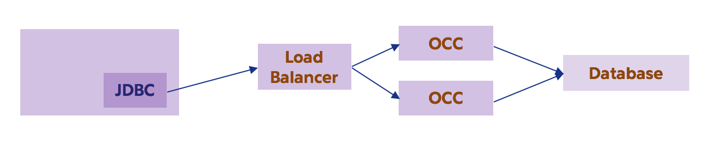
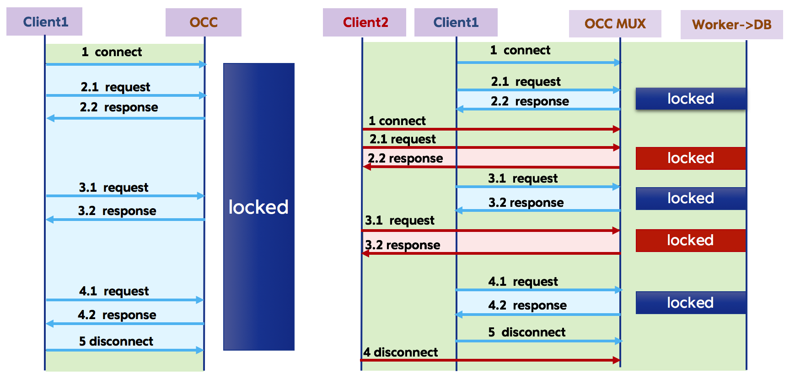

Open Connection Conglomerator Overview
======================================

The Open Connection Conglomerator (OCC) sits in between the application and the
database.  The jmux JDBC driver connects to OCC.

# Multiplexing

The OCC holds client connections and only uses a database connection when 
there's an active query.  Database transactions or queries with multiple
fetches aren't able to share the connection with other clients.

  

