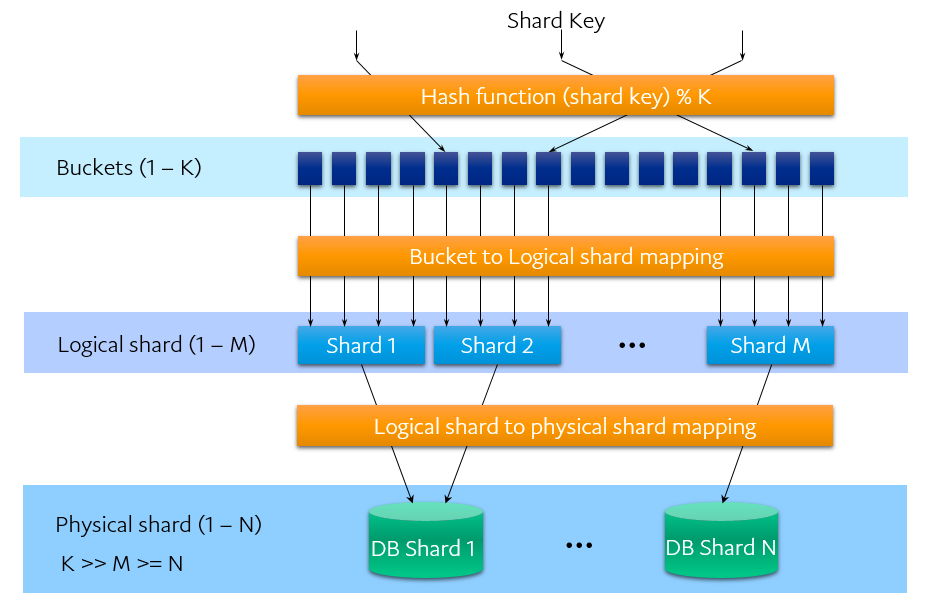
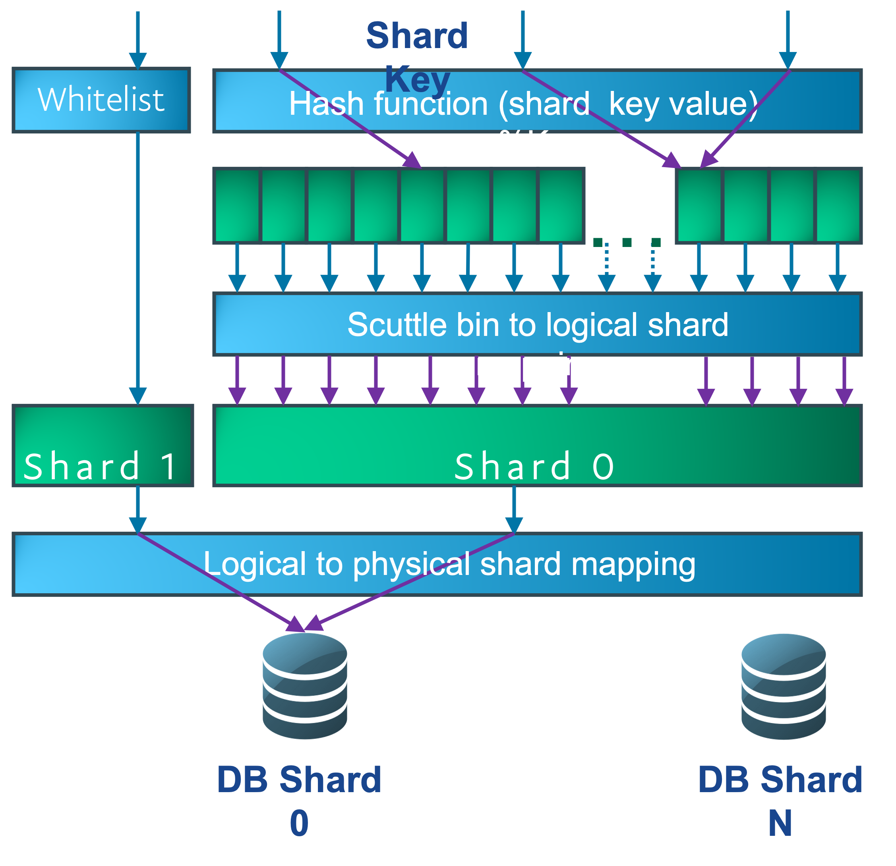
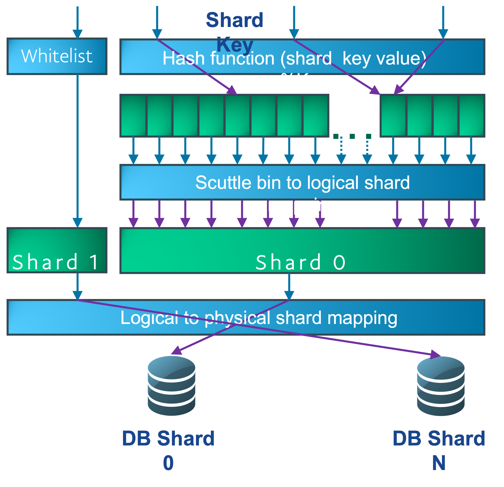
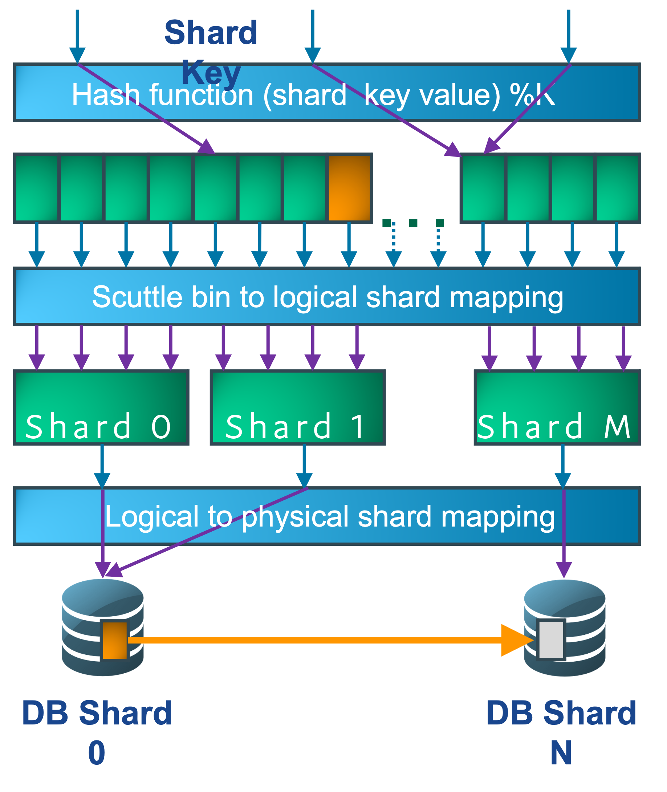
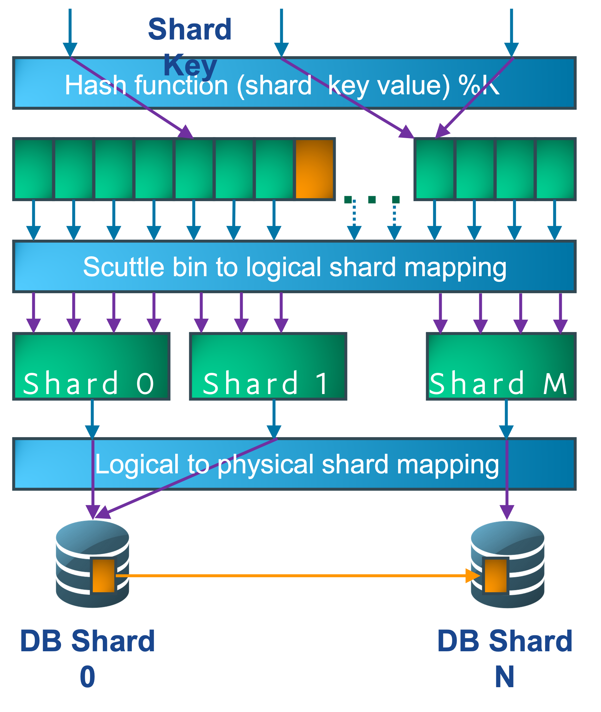
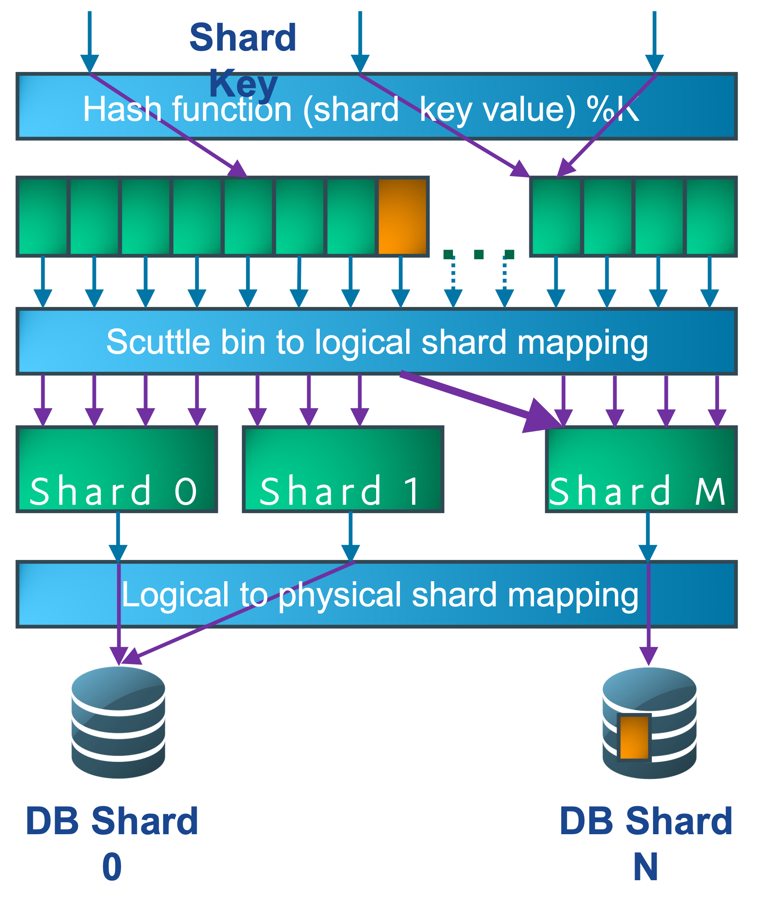

Sharding
========

Hera uses shard key column bind name and value to determine how to direct the query.

# Sharding Principles
* A schema must have exactly one shard key.
* Each table must have the shard key column.
* Queries must include shard key. 
* Queries specifying a list of keys must be rewritten to execute SQL for each shard key one at a time.
* Local sequences must be avoided.
* DB Transactions are restricted one one shard key until commit or rollback.
* During a typical user flow, limit the number of shards your application uses since using more shards impacts availablity.
* Hera server adds scuttle_id column and values to help with query execution. This is applicable only for Oracle database.

# Scenario: Migrating existing application
1. All queries directed to shard 0. DBAs create shard map table. This turns on CAL sharding events when there are transactions across shards or queries with missing shard key.
    
1. Application fixes commit across shards and queries with missing shard key.
1. DBAs and Application write SQL scripts to migrate data.
1. Hera turns on whitelist. Moving the data to a logical shard DB helps identify if there are issues.  A small number of test users are used to reduce impact of any bug that might occur with application data access pattern.
    
1. Test user physical whitelist.  Moving the data to a physical shard DB helps ensure that the tables and data movement scripts are functioning properly.
    
1. Logical whitelist.  A larger group can help identify more infrequent code paths.
1. Physical whitelist. Infrequently accessed data can be identified with a larger group.
1. Logical 1 scuttle.  The 1/1024 scuttle can have over a million customers.  This is still a small fraction of live traffic.
    
1. Physical 1 scuttle. The production data migration scripts can be validated with this step.
1. Done.  Hera turns off whitelist and connections are configured for DBA data distribution across shards.

# Scenario: Migrating scuttle data
1. DBAs setup data copies from source shard DB to destination shard DB. Typically, tables are partitioned by scuttle bins.
    
1. Once data copy is "complete," DBAs block writes (either using shard_map or triggers on a separate write blocking table)
    
1. DBAs eject long DB sessions on that scuttle
1. DBAs confirm data copy is complete.
    
1. DBAs set scuttle to allow writes.
    
1. Done

# Sample Query with shard_key=account_number
Original: select * from loan, appfile where loan.id = ? and appfile.loan_id = loan.id

jmux Switches from Position Binds: select * from loan, appfile where loan.id = ? and loan.account_number = ? and appfile.loan_id = loan.id and appfile.account_number = loan.account_number

to Bind Names: select * from loan, appfile where loan.id = :id and loan.account_number = :account_number and appfile.loan_id = loan.id and appfile.account_number = loan.account_number

The Hera server rewrites the query, computes and binds scuttle_id: select * from loan, appfile where loan.id = :id and loan.account_number = :account_number and loan.scuttle_id = :scuttle_id and appfile.loan_id = loan.id and appfile.account_number = loan.account_number and appfile.scuttle_id = loan.scuttle_id

# Unsupported Queries

Shard key name must be less than 28 char.  This is because multiple binds get a number appended to it.  The length of that bind is limited to 32 in Oracle 11.

*Within shard join*, with "reference table" (Okay)
SELECT addr1, zipT.city, zipT.state, zipT.zip
from addrT, zipT
where addrT.zip = zipT.zip and addrT.party_id = :party_id_sk and addrT.id = :addr_id

*Cross shard join* (NOT allowed in sharding)
SELECT e.name, s.name
from employee e, employee s, reporting r
where r.subordinate_id = e.id and r.supervisor_id = s.id and s.id = :boss_id_sk
-- r.subordinate_id is a FK that crosses shards! (remote foreign key RFK)
 
*Scatter-gather join* (possibly Okay)
SELECT r.supervisor_id, e.name
from employee e, reporting r
where r.subordinate_id = e.id and e.id = :employee_id_sk

*SQL Update to Shard Key*
Updating of a shard key will initially work, but it will likely be in the wrong shard after the update. This is not detected by Hera.

*Merge Upsert - Unsupported for Scuttle_id*
MERGE INTO aTable USING dual ON ( id=? AND acctNum=? )
WHEN MATCHED THEN UPDATE SET note=?
WHEN NOT MATCHED THEN INSERT (id, acctNum, note)
VALUES ( ?, ?, ? );

At the OCC-JDBC, it's difficult to ensure that acctNum binds are the same. If they differ, then :acctNum and :acctNum2 would need to be used. The occ would need to detect the difference and return an error. Both the acctNum instances in the sql text would need to be rewritten to add scuttle_id.

Other Unsupported Operations
* Queries by ROWID will not be supported – When you switch shards, the ROWID no longer applies.
Sequences are not supported – This is not detected by Hera. Each separate shard of the DB would return its own sequence and might collide.
* PL/SQL will be likely unsupported – This is not detected by Hera. The procedure would run on one shard and might not function as expected.
* Database transactions must remain in one shard key. The Hera will detect and send error to client.
* Array Binds. These are blocked since they could easily span shard key values and would need to go to different shard DBs.
