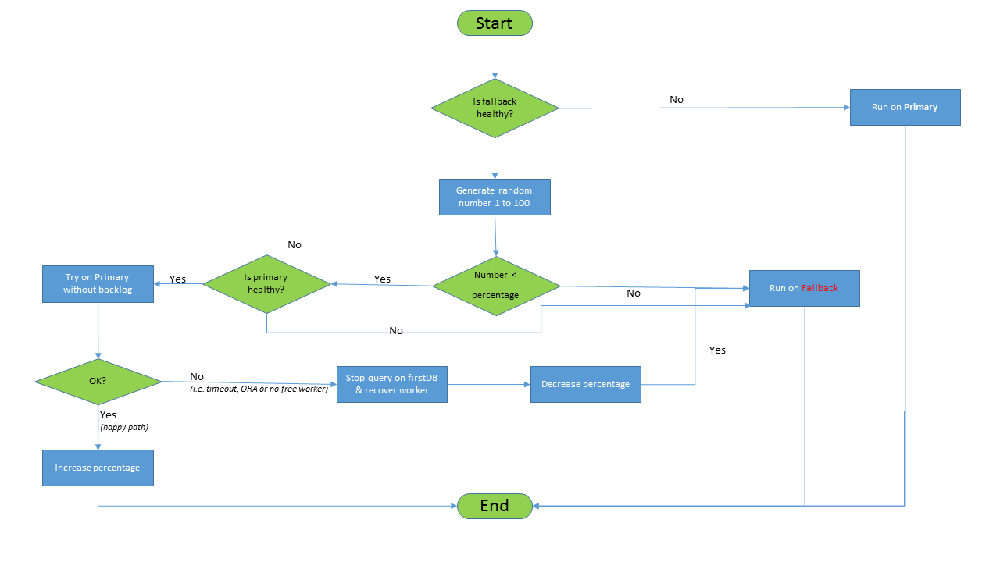

Transparent Failover
====================

Mux is configured to connect to two databases: the primary database and the fallback database. If the primary database is good, all the SQLs are sent to it. If the primary database starts having issues then mux will send a percentage of queries to the fallback database. If the primary has problems for longer time, all of the SQLs are sent to the fallback database. When the primary eventualy comes back up, all the SQLs are again routed to the primary database  

  

